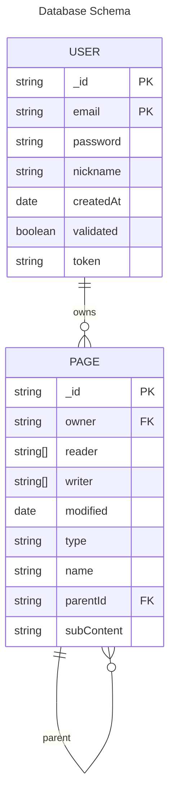
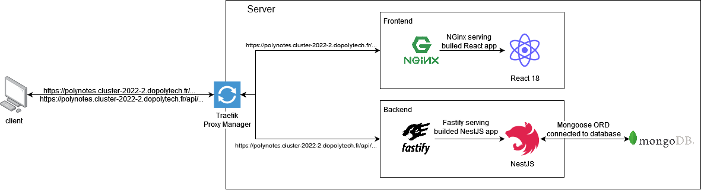

# Technical Architecture Document

## Polynotes
A productivity and organization tool Platform

**Rémi Espié**  
**DO3**  
**2023**

---
## Table of Contents

- [Introduction](#introduction)
- [Architecture](#architecture)
  - [Frontend](#frontend)
  - [Backend](#backend)
  - [Database](#database)
  - [Architecture Diagram](#architecture-diagram)
  - [CI/CD](#CICD)
- [Conclusion](#conclusion)

---
## Introduction

Polynotes is a productivity and organization tool platform, made to help students taking notes and linking them to different data, with an emphasis on project management.   
It is a web application where anyone can create an account, create folders and pages and start writing in them !  
Multiple text editing features are available, such as bold, italic, underline, strikethrough, code, and more, all available through slash commands !  
Those pages can be shared to other users through their email address, as well as to anonymous users through the page's link.

---
## Architecture

### Frontend

The frontend is made with [React 18](https://fr.reactjs.org/) (Typescript), using [ViteJS](https://vitejs.dev/) as a bundler.  
It's a single page application using React Router to handle the routing, and MaterialUI for the CSS.  
Furthermore, it uses [TipTap](https://tiptap.dev/) for the text editor, a number of its extensions as well as 
[GoCapsule/tiptap-extensions](https://github.com/GoCapsule/tiptap-extensions) for easy column management and 
[KaiSpencer/react-trello-ts](https://github.com/KaiSpencer/react-trello-ts) for the Kanban view with 
[activetable](https://activetable.io/) for the table view.

Using React was a requirement for this project, as well as using ES2023+.  
In addition, I chose to use ViteJS as a bundler, because the Create React App was just discontinued before I started this project, because I already used ViteJS and because it's one of the fastest bundler available.

I used TipTap because it's a very powerful text editor, with a lot of features, and it's very easy to use.
Thanks to its extensions, I was able to add custom features and custom React Component inside the text editor quickly and easily.  
I used a package for column management, and, even if it answers the requirements, I think that I should create a different type of column management. 
As a matter of fact, Notion, which is our inspiration for this project, manage columns and rows differently.  
However, I chose to use KaiSpencer/react-trello-ts for this first iteration, and I believe that I should make my own Kanban view in the future, because it contains a few bugs and I can't let this slide in the final version.  
Finally, I used activetable for the table view, because it's a very powerful table view, and, while being very new and little used, it's very complete easy to use.

### Backend

The backend is made with [NestJS](https://nestjs.com/), using [Fastify](https://www.npmjs.com/package/@nestjs/platform-fastify) as a web server.  
I chose [handlebars](https://handlebarsjs.com/) as a template engine, and I used [Nodemailer](https://nodemailer.com/) to send emails.  
I used [dotenv](https://www.npmjs.com/package/dotenv) to hide the credentials in a .env file or in the machine Environment Variable.
I chose to use [NestJS JWT](https://www.npmjs.com/package/@nestjs/jwt) for the authentication, with [bcrypt](https://www.npmjs.com/package/bcrypt) to hash the passwords.
It uses [MongoDB](https://www.mongodb.com/) as a database, which we will see later.  
It was all made in TypeScript, to ensure a good code quality as well as a good readability.  

I already used NestJS in a different project, and I really liked its ease of use, good documentation, and architecture philosophy, so I decided to use it again.
I used Fastify as a web server, because I already used it, and it's one of the fastest web server available.

I used handlebars as a template engine, because it's very easy to use, and it's very powerful.  
In the same way, I used Nodemailer to send emails, which is very versatile while being still easy to implement, giving me the possibility to try multiple mailing solutions.  
In the end, I chose to use my university SMTP server. However, it's not very reliable, and I should probably use a third-party service in the future.
To hide the credentials,  to store them in a .env file, which is not pushed to the repository.

### Database

The database is made with [MongoDB](https://www.mongodb.com/), using [Mongoose](https://mongoosejs.com/) as an ODM interfacing the backend.

I decided to use MongoDB because of its versatility, and because I didn't know the exact database schema I wanted to use for this project.

However, now that I made the first iteration, I think that I should use a relational database, because the versatility of MongoDB is not needed right now, and it's not the most efficient solution for this project.  
As a matter of fact, the database schema looks like this :

### Architecture Diagram

This application is deployed thanks to GitHub Actions, in multiple docker containers, using Docker Compose.

The Architecture Diagram is the following :

### CI/CD

The CI/CD is made with GitHub Actions, using GitHub's own runner to run an CodeQL Security Scan, and a Self Hosted Runner to build the Docker images and deploy them to the server.
Alongside the CodeQL Scan, I use GitHub dependabot to keep the dependencies up to date and GitHub's own security alerts to keep the code secure.

After the CodeQL Scan, the Docker images are built and then deployed to the server using Docker Compose.

Every secret is set in a .env file through the GitHub Action workflow using GitHub's Secrets.  
Backend's and Frontend Docker build consists of building the app, exposing the port, and running the built application.  
However, the Frontend Docker first builds the app using the node:lts-alpine image then copy the built app to the nginx image, which is then exposed on port 80.  
Finally, the Docker Compose file is used to deploy the application on the server, using the Docker images built by GitHub Actions, and the images of MongoDB and Traefik.

---
## Conclusion

To conclude, this iteration taught me how to use React better, and it allowed me to derisk the technologies for the next iterations.  
There are a few things that will need to change in the next iterations, such as the database, and maybe the text editor, or at least how it is currently managed.  
However, the application is already usable, and I'm very happy with the result.
