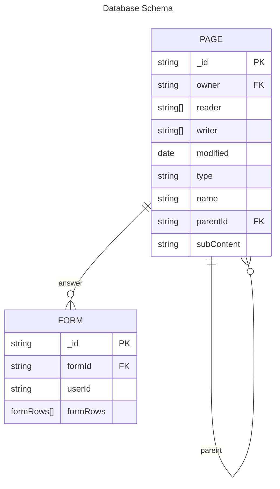

<div style="display: flex; justify-content: space-between; align-items: center; flex-direction: row;">


</div>

<div style="text-align: center">

# Technical Architecture Document

## Polynotes
A productivity and organization tool Platform

## NoSQL Documentaire
### Sujet 1: Bloc Formulaires

**Rémi Espié**  
**DO3**  
**2023**
</div>

   
   
   

## Table of Contents

- [Introduction](#introduction)
- [Architecture](#architecture)
  - [Frontend](#frontend)
  - [Backend](#backend)
  - [Database](#database)
  - [Architecture Diagram](#architecture-diagram)
- [Pros and Cons](#pros-and-cons)
- [Installation guide](#installation-guide)
- [Post Mortem](#post-mortem)

---

## Introduction

Polynotes is a productivity and organization tool platform, made to help students taking notes and linking them to different data, with an emphasis on project management.  
A first iteration was developed as a school project, and this is the second iteration, made to improve the first one and to add new features : form creation, edition and data visualization.  
One of the requirements was to use a NoSQL database, and I chose to continue using MongoDB, which was already used in the main Polynotes project.

---

## Architecture

### Frontend

The frontend is made with [React 18](https://fr.reactjs.org/) (Typescript), with [MaterialUI](https://mui.com/), using [ViteJS](https://vitejs.dev/) as a bundler.  
As the first iteration already managed pages and folders, I only had to add the form management, which was custom-made for this project using React and MaterialUI components.

A user can create or delete a form just like any page, add or remove custom questions ranging from text or paragraphs, to multiple choices with a custom answer. They can then share or unshare it whenever they want.
Although, not every "standard" form questions can be asked: sliders, date pickers, etc. are not available.

The form can be filled by anyone with the link, anonymous or not, and the answers are stored in the database.
However, an answer can not be modified once submitted, and the user can only see the answers, not edit them.

Only the user which created a form can view its answers. For the form answer visualization, I used [activetable](https://activetable.io/) again, as it was already used in the first iteration and produced beautiful customizable tables.
Every answer is inputted in this table in columns.  
Furthermore, I used [react-chartjs-2](https://www.npmjs.com/package/react-chartjs-2) to display some of the answers in a chart, namely multiple choice answer and single choice answer.
Those answers are displayed respectively in a pie chart and in an horizontal bar chart. Each seemed to be the most appropriate for their type of answer.
However, the pie chart does not display customized answers, as it would be impractical to display dozens of custom answer with all a less than 1% value.

### Backend

The backend is made with [NodeJS](https://nodejs.org/en/) (Typescript), using [Fastify](https://www.npmjs.com/package/@nestjs/platform-fastify) as a web server.
It is connected to the database using [Mongoose](https://mongoosejs.com/).

As my page-only system was made to be easily extensible, I only had to add a new model and a new service to manage the forms answer.
As a matter of fact, a form is just another type of page, so the main features of pages were already implemented, and most of the work was to add the form creation, edition and answer visualization in the frontend.

However, the form service only allow sanitized data in accordance to the form questions (i.e. a multiple choice answer can only be one of the choices, a text answer can only be a string, etc.).
Moreover, the form answer service only allow the creation of an answer if the form is shared, and if the user is not logged in, the answer is anonymous.
Finally, the way of getting every answer is through a custom mongodb aggregation which regroup every answer values by their question id, and adds the users which answered to this form before returning the result to the frontend.
This method allowed me to ease the processing of the data in the frontend, as I only had to loop through the answers and their values to display them in the table.

### Database

The database is made with [MongoDB](https://www.mongodb.com/). It is the same database as in the first iteration.
In contrast to the first iteration, a NoSQL database makes more sense for this specific feature: we don't know exactly what kind of data will be stored at form creation.
Furthermore, because some answer fields are customizable (custom choice in multiple choice), it would be impractical to store them in a relational database.

The database diagram, with only form page and answer, is the following:



   
   
   
`formRows` is the following custom type:
```typescript
type formRows = {
  name: string;
  content: any;
};
``` 

---

### Architecture Diagram

The architecture diagram is the same as the first iteration, as no breaking change were introduced:


---

## Pros and Cons

### Pros

Even if some student chose to create a new project from scratch, I chose to continue the first iteration, as it was already a good base to work on, and its page system was easily extensible.
Thanks to that, I could easily focus on adding the form creation and edition, and the answer visualization.

For this type of database storage, a NoSQL database is the most appropriate, as we don't know exactly what kind of data will be stored at form creation.
Using a MongoDB database with NestJS and Mongoose is really easy and allowed me to efficiently create the corresponding schema and service.

The activetable library which I already used was really useful to display the answers in a table, and it was fairly easy to adapt my data to the library's needs.

As I used my already working project, all of my CI/CD pipeline was already working, and I did not have to change anything.

### Cons

As I did not use a form library, I had to create my own form creation and edition system, which took times and minimized the features I implemented.
Furthermore, my implementation suffers from "lags" which I could not identify the source of. It is not really problematic as everything is usable, but it is not pleasant to use.

The CharJS library is not really easy to use, with a very specific format of values it accepts.
In addition, I did not find a way to display all the data as I would have liked, and had to make some compromises.

---

## Installation guide

As for the fist iteration, a docker-compose file is available to run the project.
However, you will need to create a `.env` file in the `backend` folder, with the following content:

```dotenv
EXPIRESIN=[cookie expiration time]
SMTP_PORT=[port for SMTP mail service]
SECRETKEY=[JWT secret key]
SMTP_PASS=[password for SMTP mail service]
SMTP_HOST=[host for SMTP mail service]
SMTP_USER=[user for SMTP mail service]
``` 

The docker-compose file will automatically build the project and launch everything. It uses Traefik and is expected to run with the domain name `polynotes.cluster-2022-2.dopolytech.fr`. Feel free to change this domain.

---

## Post Mortem

Overall, this project went without trouble, and I was able to finish it in time.

However, I did not use a form library which could have helped me to implement more types of questions and ease my development.
Moreover, as the time of writing, the addition of form questions while creating a form is really slow, and I did not have the time to troubleshoot this issue.

Finally, even if this project should have been a NoSQL project, I mainly did frontend development, and did not catch what I should have done to make this project more related to the database.
I could have done replicasets and sharding, but I did not find it useful in my case and thought it would not answer to the asked feature.